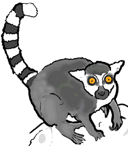
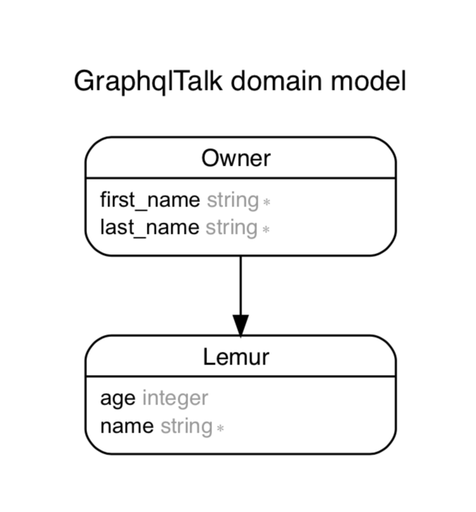

# GraphQL Talk Demo

### a.k.a. The World's First Lemur Organizer

  

This repo is a quick demo for Riaz Virani's Atlanta Ruby
Meetup Talk on GraphQL.

## Where It Starts

This is a barebones Rails project that has two models:

  

There is an `owner` with a name who owns lemurs. The `lemur` belongs to the owners

### What You Want To Do

1. Add the `graphql` gem to the project

1. Run it's generator `$ rails g graphql:install`

1. Add an `owners` query that lists the owners

1. Add a `lemurs` field to let you see lemurs for a particular owner

1. Add a `createLemur` mutation that can create a lemur

# License

This project is licensed under the [MIT License](./LICENSE)
